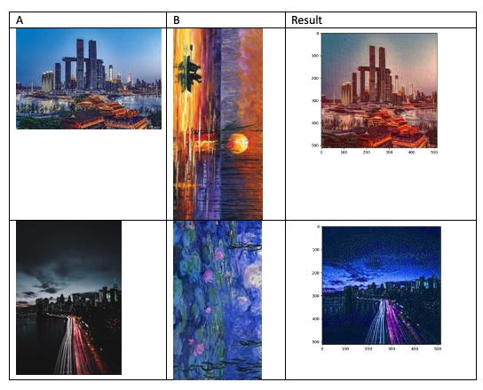

# Neural Style Transfer Using Pytorch
### Intro
We us pytorch to learn from some famous pictures, extract their drawing 
styles. Then we apply this style to a photo.

### Set Up
pip install Pillow==2.2.2
pip install torchvision
pip install torch
pip install opencv-python

### Demo
python main.py

### Result
Here we show 2 samples that we apply style of picture B to A.

