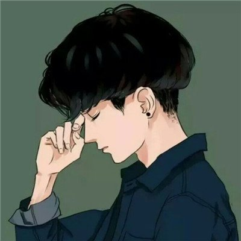
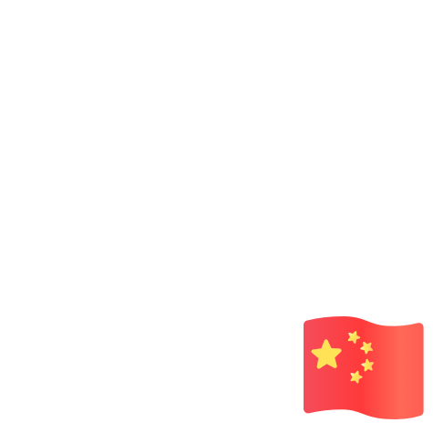
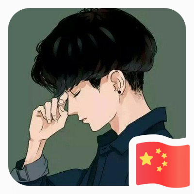

# Neural Style Transfer Using Pytorch
### Intro
We us pytorch to learn from some famous pictures, extract their drawing 
styles. Then we apply this style to a photo.

### Set Up
pip install Pillow==2.2.2
pip install torchvision
pip install torch
pip install opencv-python

### Demo
python main.py

### Result
Here we show 2 samples that we apply style of picture B to A.


# Black and White painting
In folder HandPaintPhoto. We can run handpaint.py to get result as shown:<br/>
Example 1


Example<br/>


# Change Background Color of a Photo
We also use opencv library in this work.
In BackgroundColorChange folder, run demo.py.
We change the photo with blue background to photo with red background.<br/>
<br/>
After change the result is like this. We also scale the photo a bit.
<br/>

# Add a flag Sticker to Profile Photo
We have a profile photo. 
<br/>
And we prepare a sticker with small flag.
<br/>
Run program the program profilePhotoAddFlag.py.

```user
$ cd profilePhoto/
$ python profilePhotoAddFlag.py 
pygame 1.9.6
Hello from the pygame community. https://www.pygame.org/contribute.html
Enter the size of your profile photo 400
```
Note the size of profile photo is 400.
Here is the result.
<br/>

